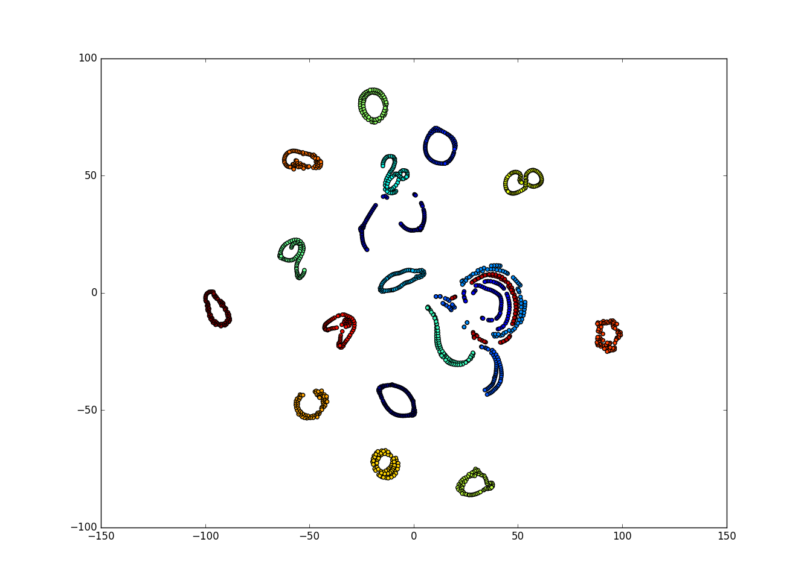

# [Visualizing High-dimensional Data](http://dl.acm.org/citation.cfm?id=3021604)

<figure><figcaption>Clusters and subclusters generated by the t-SNE algorithm. Different colors correspond to different clusters. We can see that some classes are far apart and can be easily separated while others, like those at the bottom left, are partially overlapping and are more difficult to separate.
s</figcaption></figure>